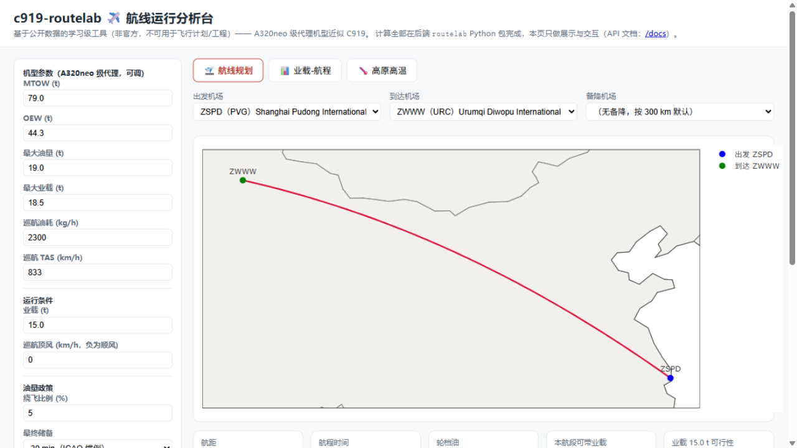
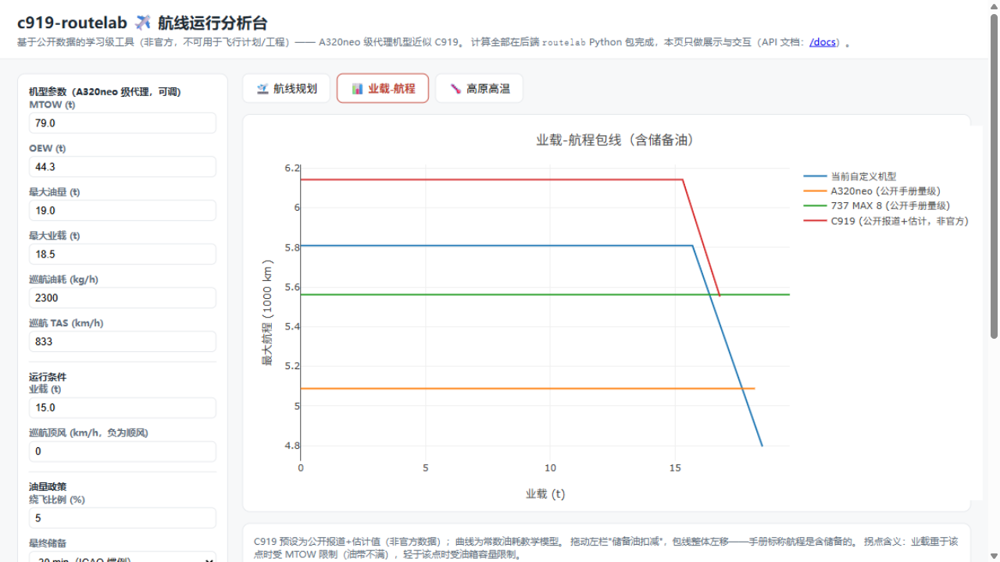
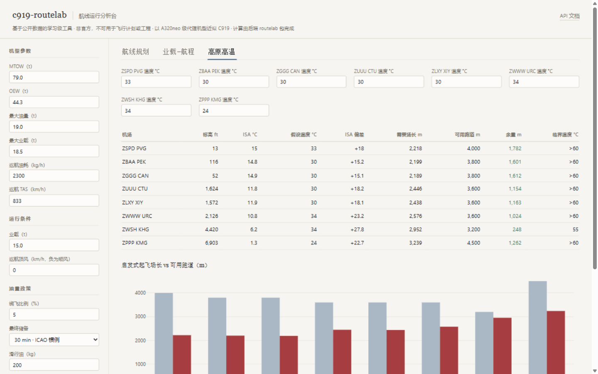

# c919-routelab ✈️

**中文** · [English](#english) · [Français](#français)

> 基于 100% 公开数据的单通道民机航线运行分析工具包（非官方学习项目）。
> An open-source, learning-grade toolkit for route-level narrow-body operations analysis, built entirely on public data (unofficial study project).
> Une boîte à outils open source et pédagogique pour l'analyse opérationnelle des lignes aériennes, construite uniquement à partir de données publiques (projet d'étude non officiel).


**非官方声明**：本项目与中国商用飞机有限责任公司（COMAC）及其任何下属单位无任何隶属、合作或授权关系；"C919" 仅作为学习研究主题的名称使用，相关商标权利归其权利人所有。所有计算结果仅供学习演示，**不可用于飞行计划、工程或任何严肃用途**。详见 [DISCLAIMER.md](DISCLAIMER.md)。

## 这是什么

给定一条航线（比如浦东 → 乌鲁木齐），回答三件事：

1. **飞得过去吗？** —— 大圆航距、业载-航程包线、高原/高温机场的起降场长修正；
2. **要带多少油？** —— 巡航油耗估算 + 简化的 CCAR-121 式油量政策（滑行 / 航程 / 5% 应急 / 备降 / 最终储备）；
3. **延误会怎么扩散？** —— （路线图中）基于 ADS-B 实测数据的延误传播网络分析。

### 特性

- 🌍 大圆航距与初始航向（球面近似，误差约 0.5% 量级，见[方法学](docs/methodology.md)）
- 🛫 机场与跑道数据层（内置 [OurAirports](https://ourairports.com/data/) 公有领域数据样本，可通过环境变量切换完整数据集）
- ✈️ 两级性能模型：简化常数油耗（默认）+ 可选 [OpenAP](https://github.com/junzis/openap) 研究级燃烧模型（油耗随重量变化，`pip install -e ".[perf]"`）
- 📊 业载-航程包线（payload–range envelope）
- ⛽ 简化油量政策，逐项输出 breakdown
- 🖥️ Web 界面（前后端分离：FastAPI 后端 `server.py` + 原生 HTML/JS 前端 `web/`，双击 `start_webapp.bat` 即用）+ CLI，计算层同源、数字一致
- 🧪 pytest 单元测试 + GitHub Actions CI + MkDocs 文档
- 🗣️ 中 / 英 / 法三语文档

## 环境要求

| 需求 | 版本 / 说明 |
|---|---|
| Python | 核心 3.10+；**OpenAP 研究级模型需 3.11+** |
| 操作系统 | Windows / macOS / Linux |
| 网络 | 仅安装时访问 PyPI；**运行时完全离线可用**（机场数据内置、图表库本地打包） |
| 浏览器 | 任意现代浏览器（Web 界面） |

所有附加功能均为可选依赖，按需安装即可，见下方[安装](#安装与使用)。

## 安装与使用

```bash
git clone https://github.com/sihanwang64-debug/c919-routelab.git
cd c919-routelab

# 核心（零可选依赖）：CLI + 大圆/性能/油量计算 + pytest 全部通过
pip install -e .
```

**网页版（推荐）**——前后端分离，FastAPI 后端 + 原生 HTML/JS 前端：

```bash
pip install -e ".[server]"
python run_server.py        # Windows 也可直接双击 start_webapp.bat
# 浏览器打开 http://127.0.0.1:8300 ，API 交互文档在 /docs
```

**命令行**：

```bash
# 大圆距离与初始航向
routelab distance ZSPD ZWWW

# 单段航线的油量估算（含备降与简化油量政策）
routelab range ZSPD ZWWW --alternate ZWSH

# 切换 OpenAP 研究级燃烧模型（需先 pip install -e ".[perf]"）
routelab range ZSPD ZWWW --backend openap --actype a320

# 列出内置样本机场
routelab airports --country CN
```

不想敲命令行？双击 `start_webapp.bat` 打开 [Web 界面](#web-界面前后端分离fastapi--原生-htmljs)，选选机场拖拖参数就有同样的结果。

**开发 / 测试 / 文档**：

```bash
pip install -e ".[dev,app,server,perf]"
pytest -q          # 46 个测试
ruff check .       # lint
mkdocs serve       # 本地预览文档站
```

## 仓库结构（速览）

```
c919-routelab/
├── server.py               # FastAPI 后端：REST API + 托管前端
├── run_server.py           # 一键启动后端并打开浏览器
├── start_webapp.bat        # Windows 双击入口
├── web/                    # 前端（index.html + app.js + style.css，零业务逻辑）
├── src/routelab/
│   ├── airports.py         # 机场/跑道数据层（OurAirports）
│   ├── greatcircle.py      # 大圆航距/航向/弧线采样
│   ├── performance.py      # 巡航/场长性能（简化模型）
│   ├── openap_backend.py   # OpenAP 研究级燃烧模型（可选）
│   ├── fuel.py             # 简化油量政策
│   ├── planning.py         # 航段计划（CLI/API 共用计算层）
│   ├── presets.py          # 公开参数对比机型
│   └── cli.py              # 命令行入口
├── cases/                  # 案例 notebook（可复现）
├── tests/                  # pytest（46 个）
└── docs/                   # MkDocs 文档 + 界面截图
```

## Web 界面（前后端分离：FastAPI + 原生 HTML/JS）

**启动（Windows 最快路径）**：双击仓库根目录的 `start_webapp.bat` —— 自动选 venv/系统 Python、起后端并打开浏览器 [http://127.0.0.1:8300](http://127.0.0.1:8300)（`Ctrl+C` 停止）。

**手动启动**：

```bash
pip install -e ".[server]"     # 核心包 + fastapi + uvicorn
python run_server.py           # 或：uvicorn server:app --port 8300 --reload
```

**架构**（后续开发就按这个分层走）：

```
浏览器 web/（index.html + app.js + style.css，只做展示与交互）
    │  fetch /api/*
    ▼
server.py（FastAPI：REST API + 托管 web/ 静态文件，交互式文档在 /docs）
    │  直接调用
    ▼
src/routelab/（计算内核：airports / performance / fuel / planning / presets）
```

- 后端接口：`GET /api/airports`、`GET /api/presets`、`POST /api/route`（航段计划）、`POST /api/envelope`（业载-航程）、`POST /api/hot`（场长余量）
- 所有数字由 Python 包计算，前端零业务逻辑——CLI 与 Web 两个入口同源，数字永远一致
- 后端加功能 = 在 `routelab` 包里写函数 + 在 `server.py` 暴露端点；前端只需调接口

三个标签页的用法（左侧边栏为全局参数）：

### 航线规划

1. 下拉选择**出发 / 到达 / 备降**机场（内置 11 个样本机场，国内 8 个；接入完整 OurAirports 数据集的方法见[数据来源](docs/data-sources.md)）；
2. 地图即时画出大圆航线（红色实线）与备降航段（橙色虚线），悬停机场标记可看标高；
3. 下方给出航距（km/NM）、航程时间、轮档油、本航段可带业载与可行性判定，以及轮档油构成的条形图与明细表。



### 业载–航程

- 调整**储备油扣减**，整组包线左移——直观体会"手册航程是含储备的"；
- 勾选对比机型（A320neo / 737 MAX 8 / C919 估计值），与"当前自定义机型"同图对比，悬停曲线读任意业载点的最大航程。



### 高原高温

- 为 8 个国内样本机场分别设定假设温度（默认七月午后情景）；
- 表格与柱状图输出：需要场长 vs 可用跑道的**余量**，以及"热到几度顶满跑道"的**临界温度**。



### 侧栏参数说明

| 参数 | 含义 | 默认 |
|---|---|---|
| 机型参数 | MTOW / OEW / 最大油量 / 最大业载 / 巡航油耗 / 巡航 TAS | A320neo 级代理 |
| 业载 | 当前航段假设业载 | 15 t |
| 巡航顶风 | 平均巡航风分量，负值为顺风 | 0 km/h |
| 绕飞比例 | 占航程油的百分比 | 5% |
| 最终储备 | 30 min（ICAO 惯例）或 45 min（CCAR-121 国内惯例） | 30 min |
| 滑行油 | 固定滑行 allowance | 200 kg |

Web 界面与 CLI 共用同一个计算层 `routelab.planning.plan_leg()`，两边数字永远一致。

## 性能模型：简化 vs OpenAP

| | 简化模型（默认） | OpenAP 研究级 |
|---|---|---|
| 巡航油耗 | 常数（如 2 300 kg/h） | 随重量逐点积分（BADA 派生公开模型） |
| MTOW / OEW | 手册量级估计 | OpenAP 机型数据库（如 a320：78.0 / 42.6 t） |
| 备降/储备油 | 按巡航油耗折算 | 备降段用航后重量、储备用备降后重量评估 |
| 依赖 | 无 | `pip install -e ".[perf]"`（**Python 3.11+**） |
| 机型 | A320neo 级代理，参数可调 | 37 个公开型号（a320、b738、a359…）；C919 无公开模型，用 a320 同级代理 |

使用方式：装好 OpenAP 后，在 Web 界面左上「性能模型」下拉切换（机型选择器随即出现），或 CLI 加 `--backend openap --actype a320`，或 API 请求体加 `"backend": "openap"`。

- **程序自动检测**：未安装 openap 时一切照常——界面选项自动禁用、测试自动跳过，绝不报错；安装后无需任何配置即刻可用；
- **诚实提醒**：OpenAP 基于公开科研数据（BADA 派生），个别新机型（如 a20n）的数据偏乐观，读数注意甄别；两级模型的所有结果都**不可用于飞行计划或工程**。

## 案例集（cases/）

| 案例 | 问题 | 状态 |
|---|---|---|
| [01 业载-航程](cases/01_range_payload.ipynb) | C919（估计参数）vs A320neo vs 737 MAX 8 的业载-航程包线，谁被油箱卡住？OEW 敏感性多大？ | ✅ 已完成 |
| [02 高原高温](cases/02_hot_high.ipynb) | 浦东—乌鲁木齐/喀什：高温高原机场的起降场长余量与备降油量 | ✅ 已完成 |
| [03 延误传播](cases/03_delay_network.ipynb) | 机尾号轮转链上的延误传染：lift 检验、传播枢纽、机场流量（合成数据 + OpenSky 对照） | ✅ 已完成 |
| [04 机队情景](cases/04_fleet_scenario.ipynb) | 2026–2030 三种交付节奏下，机队何时撑起 18 条航线网络？座位投放与利用率敏感性 | ✅ 已完成 |

## 方法学与诚实话

- C919 没有公开性能数据，本仓库用**同级别代理机型**（约 170 座、LEAP-1 级发动机的 A320neo 级参数）做近似，所有参数与假设在 [docs/methodology.md](docs/methodology.md) 中逐条列明；
- 简化模式下巡航油耗视为常数；切换 OpenAP 模式后油耗随重量变化（见方法学 1b 节）；起降场长是启发式公式，系数全部写在代码里；
- 油量政策参考 CCAR-121 / ICAO Annex 6 的结构做了大幅简化，**不保守、不权威**；
- 数据来源全部公开，见 [docs/data-sources.md](docs/data-sources.md)。

## 路线图

- [x] v0.1 仓库骨架：CLI + 大圆 + 机场数据 + 性能/油量内核 + CI
- [x] v0.2 业载-航程案例 notebook + 高原高温案例 notebook
- [x] 前后端分离 Web 版：FastAPI API（`server.py`）+ 原生前端（`web/`），`start_webapp.bat` 一键启动
- [ ] 文档站上线 GitHub Pages（工作流已就绪并停用中：私有仓库需 GitHub Pro，转公开即可启用）
- [x] OpenAP 研究级燃烧模型后端（`routelab/openap_backend.py`，CLI/API/界面均可切换）
- [x] v0.3 延误传播网络分析：`network.py` 机尾链图 + lift/枢纽/流量指标 + 案例 03（合成数据验证方法学，OpenSky 实测对照带缓存与优雅回退）
- [x] v0.4 案例 04 机队情景 + 完整 OurAirports 数据集下载脚本（`scripts/download_airports.py`）
- [x] v1.0 打 tag 发布（四个案例 + 双版本界面 + 两级性能模型齐备）

## 常见问题

- **页面打开后图表空白？** 静态资源带版本号缓存，先按 `Ctrl+F5` 强制刷新；图表库已打包在 `web/vendor/`，正常情况无需联网。
- **启动报 `WinError 10048`（端口被占用）？** 已有一个实例在运行——先关掉旧实例再启动（或修改 `run_server.py` 里的 `PORT`）。
- **「性能模型」里 OpenAP 选项是灰色的？** 未安装 openap（`pip install -e ".[perf]"`）或 Python 版本低于 3.11。缺失时程序照常运行，只是该选项不可用。
- **机场太少 / 想加机场？** 运行 `python scripts/download_airports.py` 下载完整数据集（86k 机场，含 ft→m 兼容），脚本会打印需要设置的两个环境变量，见[数据来源](docs/data-sources.md)。
- **C919 的参数是官方的吗？** 不是——COMAC 未公开性能数据，参数来自公开报道与估计并逐项标注（见[方法学](docs/methodology.md)），仅作学习演示。

## English

**c919-routelab** is an open-source, learning-grade toolkit for route-level operations analysis of single-aisle airliners, built entirely on public data (OurAirports airports and runways, public aircraft specifications, later OpenSky ADS-B). Given an origin–destination pair it estimates great-circle distance, a payload–range envelope, heuristic takeoff field lengths with altitude/temperature corrections, and a simplified CCAR-121-style fuel breakdown (taxi, trip, 5% contingency, alternate, final reserve). The C919 has no open performance data, so a clearly documented A320neo-class proxy aircraft is used; an optional `openap` extra is planned to swap in a research-grade model. An optional web app (FastAPI backend `server.py` + vanilla HTML/JS frontend in `web/`, launched via `python run_server.py` or `start_webapp.bat`) puts the same computation layer behind a GUI: a map-based route planner with great-circle drawing, an interactive payload-range chart with aircraft comparison, and hot-and-high field-length margins. Everything here is for education only — not for flight planning or engineering. See `docs/` for methodology and data sources. Requirements: Python 3.10+ for the core toolkit (fully offline at runtime); the optional research-grade burn model backed by [OpenAP](https://github.com/junzis/openap) (`pip install -e ".[perf]"`) needs Python 3.11+ and is auto-detected at runtime — without it, the constant-flow proxy model remains the default and everything else works unchanged.

## Français

**c919-routelab** est une boîte à outils open source et pédagogique pour l'analyse opérationnelle des avions monocoulois, construite entièrement à partir de données publiques. Pour une paire origine–destination donnée, elle estime la distance orthodromique, l'enveloppe charge utile–distance, des longueurs de piste corrigées de l'altitude et de la température, ainsi qu'une décomposition simplifiée du carburant (roulage, trajet, contingence de 5 %, aérodrome de dégagement, réserve finale). En l'absence de données de performance ouvertes sur le C919, un appareil proxy de classe A320neo est utilisé et documenté. Une application web optionnelle (backend FastAPI `server.py` + frontend HTML/JS dans `web/`, lancée via `python run_server.py` ou `start_webapp.bat`) propose la même couche de calcul en interface graphique : planification de routes sur carte, enveloppe charge–distance interactive et marges de longueur de piste en conditions chaudes et hautes. Réservé à l'apprentissage — pas pour le vol réel. Prérequis : Python 3.10+ pour le noyau (fonctionnement hors ligne) ; le modèle de combustion recherche optionnel [OpenAP](https://github.com/junzis/openap) (`pip install -e ".[perf]"`) requiert Python 3.11+ et est détecté automatiquement — sans lui, le modèle simplifié à flux constant reste le choix par défaut.

## License

MIT — see [LICENSE](LICENSE).
